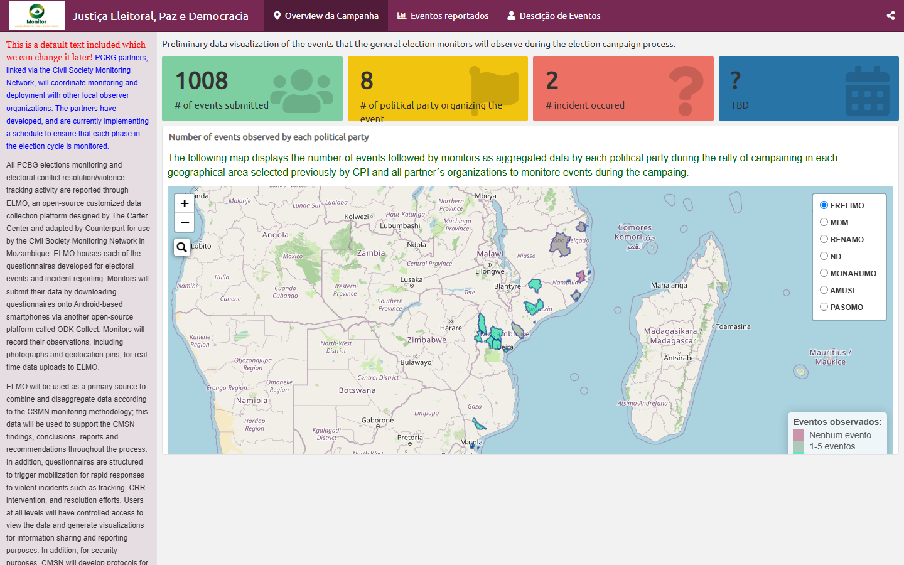
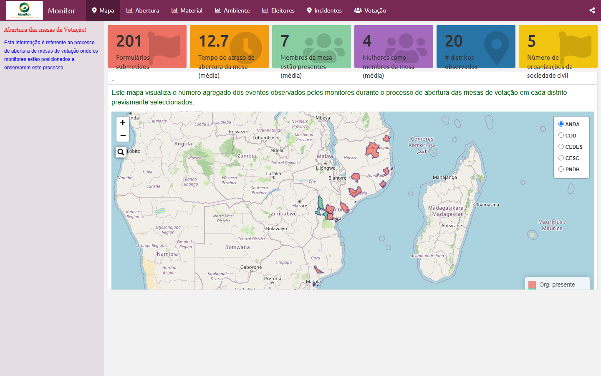
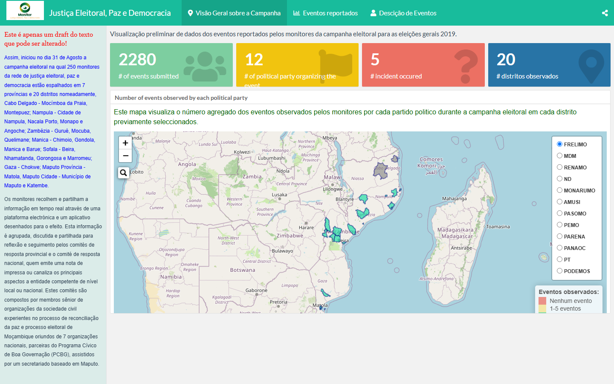

::: {.hero}
::: {.hero-grid}
{.avatar fig-alt="Antonio Rungo"}

::: {}
[Data Science · Biostatistics]{.eyebrow}

# Data, made to make sense.

::: {.sub}
I'm **Antonio Rungo** — Senior Strategic Information Advisor at **mothers2mothers**, working on HIV/PMTCT to help eliminate paediatric AIDS. Biostatistician who loves turning analysis into clear, dynamic visualization.
:::

::: {.cta}
[View dashboards](#dashboards){.btn-cc .primary}
[Curriculum Vitae](https://anrungo.github.io/resume/){.btn-cc .ghost target="_blank"}
:::

::: {.pills}
[HIV/PMTCT]{.pill} [Data Visualization]{.pill} [Monitoring & Evaluation]{.pill} [RStudio]{.pill} [IA]{.pill} [Automations]{.pill} [Maputo, Mozambique]{.pill}
:::
:::
:::
:::

::: {.sec-head}
## About Me
:::

I am a biostatistician currently working as **Senior Strategic Information Advisor**. Previously I worked as an independent consultant and as an M&E advisor at an international non-governmental organization in Mozambique, focused on continuous quality improvement (CQI) — supporting internal Data Quality Assessments (iDQA) by implementing partners, providing technical assistance to the Ministry of Health, developing and delivering training materials, coordinating and aligning Global Programs activities through an M&E lens, and ongoing capacity building and mentorship for MOH and partner staff.

Earlier, I worked as a Voluntary Medical Male Circumcision (VMMC) project manager and data analyst, and as a database manager at the International Training and Education Center for Health (I-TECH) Mozambique office.

I have skills in developing and maintaining effective, up-to-date monitoring & evaluation and operational-research systems — ensuring implementation of programs and projects, designing data-entry screens, developing data-collection tools for operational research, and handling data analysis and research reporting.

::: {.sec-head}
::: {}
## Featured work {#dashboards}

My book and interactive election-monitoring dashboards — open each one in a new view.
:::
[All projects →](projects.qmd)
:::

```{=html}
<div class="carousel-cc" data-carousel>
  <div class="viewport"><div class="track" data-track>

    <article class="slide slide--book">
      <div class="slide__img"></div>
      <div class="slide__body">
        <span class="slide__kicker">Book · Career Guide</span>
        <h3>Building Your Analytics Career Journey</h3>
        <p>A handy guide to boosting your career, building your brand, and telling stories with data — now available on Amazon.</p>
        <a class="open-link" href="https://www.amazon.com/dp/B0DS57FNZV" target="_blank" rel="noopener">Buy on Amazon
          <svg width="16" height="16" viewBox="0 0 24 24" fill="none" stroke="currentColor" stroke-width="2"><path d="M5 12h14M13 6l6 6-6 6"/></svg></a>
      </div>
    </article>

    <article class="slide">
      <div class="slide__img"></div>
      <div class="slide__body">
        <span class="slide__kicker">Justiça Eleitoral · 2019</span>
        <h3>Campaign Monitor</h3>
        <p>Election campaign events tracked by monitors — incidents by political party, mapped across Mozambique.</p>
        <a class="open-link" href="Monitor_Dashboards.html" target="_blank">Open dashboard
          <svg width="16" height="16" viewBox="0 0 24 24" fill="none" stroke="currentColor" stroke-width="2"><path d="M5 12h14M13 6l6 6-6 6"/></svg></a>
      </div>
    </article>

    <article class="slide">
      <div class="slide__img"></div>
      <div class="slide__body">
        <span class="slide__kicker">Polling Stations</span>
        <h3>Opening of Polling Stations</h3>
        <p>Timeliness of opening, presence of observers and party agents per district on election day.</p>
        <a class="open-link" href="Monitor_Dashboards_Abertura.html" target="_blank">Open dashboard
          <svg width="16" height="16" viewBox="0 0 24 24" fill="none" stroke="currentColor" stroke-width="2"><path d="M5 12h14M13 6l6 6-6 6"/></svg></a>
      </div>
    </article>

    <article class="slide">
      <div class="slide__img"></div>
      <div class="slide__body">
        <span class="slide__kicker">Voting Day</span>
        <h3>Voting Day Monitor</h3>
        <p>Over 2,280 observation events aggregated by district across the country during the vote.</p>
        <a class="open-link" href="Monitor_Dashboards_PT.html" target="_blank">Open dashboard
          <svg width="16" height="16" viewBox="0 0 24 24" fill="none" stroke="currentColor" stroke-width="2"><path d="M5 12h14M13 6l6 6-6 6"/></svg></a>
      </div>
    </article>

  </div></div>
  <button class="nav-btn" data-prev aria-label="Previous"><svg width="18" height="18" viewBox="0 0 24 24" fill="none" stroke="currentColor" stroke-width="2"><path d="M15 18l-6-6 6-6"/></svg></button>
  <button class="nav-btn" data-next aria-label="Next"><svg width="18" height="18" viewBox="0 0 24 24" fill="none" stroke="currentColor" stroke-width="2"><path d="M9 6l6 6-6 6"/></svg></button>
  <div class="carousel__dots" data-dots></div>
</div>
```

```{=html}
<section class="contact-band">
  <div class="contact-band__inner">
    <span class="contact-band__eyebrow">Get in touch</span>
    <h2>Let's work together</h2>
    <p>Have a project, a dataset, or just want to say hi? I'm always happy to talk data, dashboards and M&amp;E.</p>

    <div class="contact-band__actions">
      <a class="btn-contact" href="mailto:tony.niquisse@gmail.com">
        <svg width="18" height="18" viewBox="0 0 24 24" fill="none" stroke="currentColor" stroke-width="2"><path d="M4 4h16v16H4z"/><path d="m4 6 8 6 8-6"/></svg>
        Email me
      </a>
      <span class="contact-band__loc">
        <svg width="16" height="16" viewBox="0 0 24 24" fill="none" stroke="currentColor" stroke-width="2"><path d="M12 21s-7-5.2-7-11a7 7 0 0 1 14 0c0 5.8-7 11-7 11Z"/><circle cx="12" cy="10" r="2.5"/></svg>
        Maputo, Mozambique
      </span>
    </div>

    <div class="contact-band__social">
      <a href="https://github.com/anrungo" target="_blank" aria-label="GitHub"><svg width="20" height="20" viewBox="0 0 24 24" fill="currentColor"><path d="M12 2a10 10 0 0 0-3.16 19.49c.5.09.68-.22.68-.48v-1.7c-2.78.6-3.37-1.34-3.37-1.34-.45-1.16-1.11-1.47-1.11-1.47-.91-.62.07-.61.07-.61 1 .07 1.53 1.03 1.53 1.03.89 1.53 2.34 1.09 2.91.83.09-.65.35-1.09.63-1.34-2.22-.25-4.55-1.11-4.55-4.94 0-1.09.39-1.98 1.03-2.68-.1-.25-.45-1.27.1-2.65 0 0 .84-.27 2.75 1.02a9.5 9.5 0 0 1 5 0c1.91-1.29 2.75-1.02 2.75-1.02.55 1.38.2 2.4.1 2.65.64.7 1.03 1.59 1.03 2.68 0 3.84-2.34 4.69-4.57 4.94.36.31.68.92.68 1.85v2.74c0 .27.18.58.69.48A10 10 0 0 0 12 2Z"/></svg></a>
      <a href="https://www.linkedin.com/in/antonio-rungo-ab419b17/" target="_blank" aria-label="LinkedIn"><svg width="20" height="20" viewBox="0 0 24 24" fill="currentColor"><path d="M4.98 3.5a2.5 2.5 0 1 1 0 5 2.5 2.5 0 0 1 0-5ZM3 9h4v12H3zM9 9h3.8v1.7h.05c.53-1 1.83-2.05 3.77-2.05 4.03 0 4.78 2.65 4.78 6.1V21h-4v-5.4c0-1.29-.02-2.95-1.8-2.95-1.8 0-2.08 1.4-2.08 2.85V21H9z"/></svg></a>
      <a href="https://twitter.com/aniquisse" target="_blank" aria-label="Twitter"><svg width="20" height="20" viewBox="0 0 24 24" fill="currentColor"><path d="M18.9 2H22l-7.5 8.6L23 22h-6.8l-5.3-7-6.1 7H1.7l8-9.2L1 2h7l4.8 6.4L18.9 2Zm-2.4 18h1.9L7.6 3.9H5.6z"/></svg></a>
    </div>
  </div>
</section>
```
